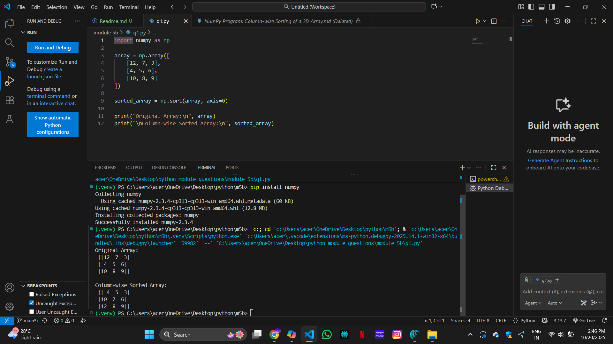
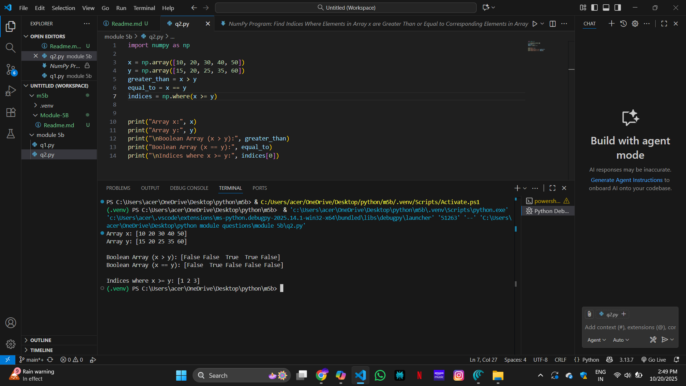
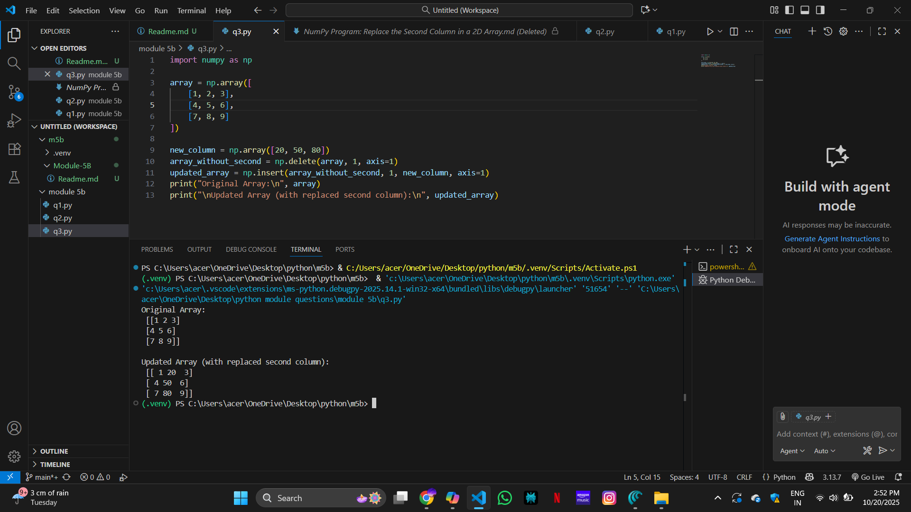
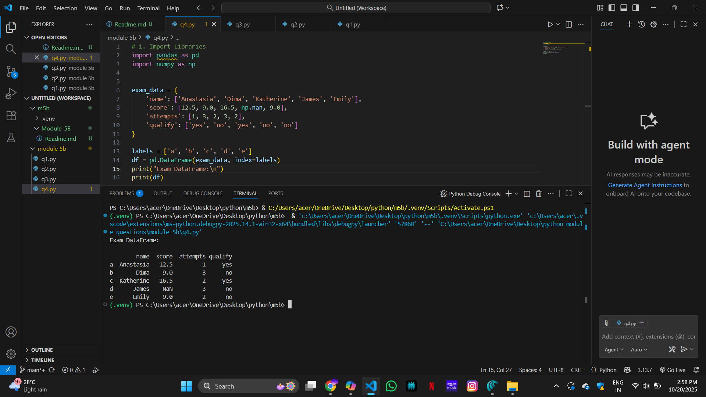
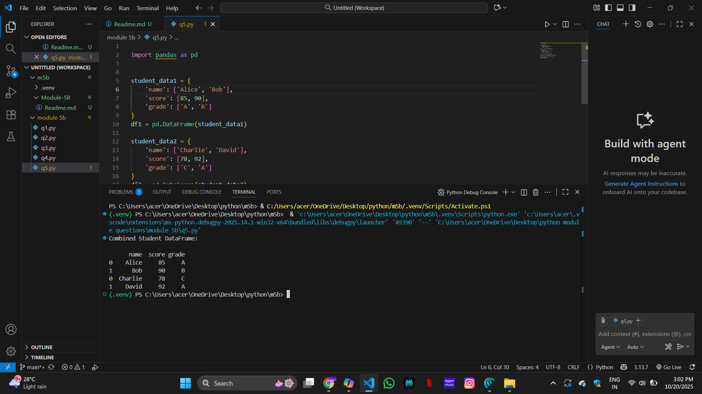

# NumPy Program: Column-wise Sorting of a 2D Array

## 🎯 Aim
To write a **NumPy** program that sorts the elements in each column of a given 2D array in ascending order.

## 🧠 Algorithm

1. **Import NumPy**: Start by importing the NumPy library.
2. **Get Input**: Accept a 2D NumPy array from the user.
3. **Sort Column-wise**: Use the `np.sort()` function with `axis=0` to sort each column in ascending order.
4. **Store Result**: Store the sorted result in a new array.
5. **Display Output**: Print the original array and the column-wise sorted array.

## 🧾 Program
'''
import numpy as np

array = np.array([
    [12, 7, 3],
    [4, 5, 6],
    [10, 8, 9]
])

sorted_array = np.sort(array, axis=0)

print("Original Array:\n", array)
print("\nColumn-wise Sorted Array:\n", sorted_array)
'''

## Output

## Result
The python programe for coloumn sorting using numpy is successfully is executed

# # NumPy Program: Find Indices Where Elements in Array x are Greater Than or Equal to Corresponding Elements in Array y

## 🎯 Aim
To write a Python program using **NumPy** that finds the indices where elements in array `x` are greater than or equal to their corresponding elements in array `y`.

## 🧠 Algorithm
1. **Import NumPy**: Import the NumPy library.
2. **Define Arrays**: Define two NumPy arrays, `x` and `y`, with the same shape (i.e., same number of elements).
3. **Use Boolean Indexing**: 
   - `x > y` gives a boolean array where elements of `x` are greater than `y`.
   - `x == y` gives a boolean array where elements of `x` are equal to `y`.
4. **Find Indices**: Use `np.where()` to get the indices where the conditions `x >= y` are satisfied.
5. **Print Indices**: Print the indices where the condition holds true.

## 🧾 Program
'''
import numpy as np

x = np.array([10, 20, 30, 40, 50])
y = np.array([15, 20, 25, 35, 60])
greater_than = x > y
equal_to = x == y
indices = np.where(x >= y)

print("Array x:", x)
print("Array y:", y)
print("\nBoolean Array (x > y):", greater_than)
print("Boolean Array (x == y):", equal_to)
print("\nIndices where x >= y:", indices[0])
'''
## Output

## Result
The python programe to find the indices of elements greater or smaller using numpy is successfully executed

# NumPy Program: Replace the Second Column in a 2D Array

## 🎯 Aim
To write a **NumPy** program that deletes the second column from a given 2D array and inserts a new column at the same position.

## 🧠 Algorithm
1. **Import NumPy**: Start by importing the NumPy library.
2. **Get Input**: Get a 2D NumPy array and a new column (as another array) from the user.
3. **Delete Column**: Use `np.delete()` to remove the second column (index 1) from the original array.
4. **Insert Column**: Use `np.insert()` to insert the new column at the second column's original position.
5. **Display Result**: Print the updated array with the replaced column.

## 🧾 Program
'''
import numpy as np

array = np.array([
    [1, 2, 3],
    [4, 5, 6],
    [7, 8, 9]
])

new_column = np.array([20, 50, 80])  
array_without_second = np.delete(array, 1, axis=1)
updated_array = np.insert(array_without_second, 1, new_column, axis=1)
print("Original Array:\n", array)
print("\nUpdated Array (with replaced second column):\n", updated_array)
'''
## Output

## Result
The python programe for replacing a array using numpy is successfully executed

# Pandas Program: Create and Display a DataFrame with Custom Index Labels

## 🎯 Aim

To create and display a **DataFrame** using the **Pandas** library in Python from a given dictionary, and apply specific index labels to the rows.

---

## 🧠 Algorithm

1. **Import Libraries**: Import the required libraries – `pandas` and `numpy`.
2. **Create Dictionary**: Define a dictionary `exam_data` with keys: `'name'`, `'score'`, `'attempts'`, and `'qualify'`.
3. **Index Labels**: Create a list of custom index labels called `labels`.
4. **Create DataFrame**: Use `pd.DataFrame()` to create the DataFrame by passing the dictionary and index labels.
5. **Display Output**: Display the DataFrame using `print()` or by simply calling the DataFrame variable.

---

## 💻 Program
'''
# 1. Import Libraries
import pandas as pd
import numpy as np

exam_data = {
    'name': ['Anastasia', 'Dima', 'Katherine', 'James', 'Emily'],
    'score': [12.5, 9.0, 16.5, np.nan, 9.0],
    'attempts': [1, 3, 2, 3, 2],
    'qualify': ['yes', 'no', 'yes', 'no', 'no']
}

labels = ['a', 'b', 'c', 'd', 'e']
df = pd.DataFrame(exam_data, index=labels)
print("Exam DataFrame:\n")
print(df)
'''

## Output

## Result
The python programe for printing the dataframe using pandas is successfully executed

# 🧪 Pandas Program: Join Two DataFrames Along Rows

## 🎯 AIM

To write a Python program using Pandas to **join two DataFrames along rows** (row-wise concatenation) and assign all data to a new DataFrame.

---

## 🧠 ALGORITHM

1. **Import Libraries**: Import the `pandas` library.
2. **Create First DataFrame**: Use a dictionary to create `student_data1`.
3. **Create Second DataFrame**: Use another dictionary to create `student_data2`.
4. **Concatenate DataFrames**: Use `pd.concat()` with `axis=0` to concatenate both DataFrames row-wise.
5. **Display Result**: Print the new combined DataFrame.

---

## 💻 Program
'''

import pandas as pd

student_data1 = {
    'name': ['Alice', 'Bob'],
    'score': [85, 90],
    'grade': ['A', 'B']
}
df1 = pd.DataFrame(student_data1)

student_data2 = {
    'name': ['Charlie', 'David'],
    'score': [78, 92],
    'grade': ['C', 'A']
}
df2 = pd.DataFrame(student_data2)

combined_df = pd.concat([df1, df2], axis=0)

print("Combined Student DataFrame:\n")
print(combined_df)
'''
## Output

## Result
The python programe for joining two dataframes using pandas is successfully executed
